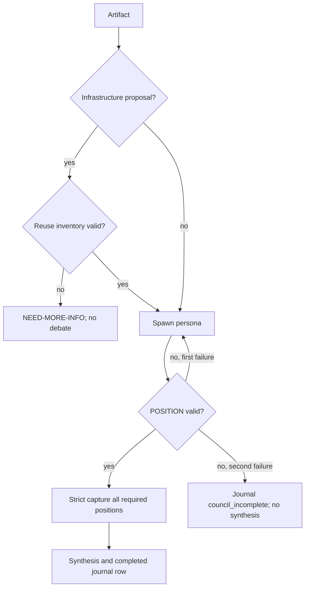

# PRD: Fail councils closed on missing input integrity

- one-line description: Stop a council before debate or synthesis when its capability context or required persona evidence is incomplete.
- status: problem-review
- responsible owner: Zhach Volker
- linked resources: GitHub issue [#78](https://github.com/Zhachory1/agent-fleet/issues/78); `prompts/council-orchestrator.md`; `lib/transcript.sh`; `lib/journal.sh`
- next gate: council design review

## Problem

Council can approve a narrow proposal that omitted an existing capability. It can also treat missing or malformed persona output as independent review if orchestrator fills gap. Both make council evidence false.

## Why This Matters

- user impact: Operators need `NEED-MORE-INFO` or incomplete result, not a confident false verdict.
- why now: Issue #78 reports both gaps in current protocol.
- evidence:
  - source: Issue #78, 2026-08-27.
  - finding: Current prompt mandates capture but does not validate required POSITION fields or block synthetic replacement.
  - confidence: high.

## Current State

- `transcript.sh capture` stores any `@@from:` block if at least one exists.
- `journal.sh append` only requires a non-empty transcript.
- Council prompt asks for a POSITION but does not define retry, failure termination, reuse-inventory gate, or an incomplete journal record.

## Goals

| Goal | Signal | Target |
|---|---|---:|
| Stop missing reuse context | Infrastructure artifact without valid inventory returns `NEED-MORE-INFO` before debate | 100% in focused tests |
| Preserve persona evidence integrity | Empty, malformed, or incomplete required POSITION cannot enter position capture | 100% in focused tests |
| Fail closed after retry | Second failed response ends council incomplete; no synthesis or verdict | 100% in focused tests |
| Keep incomplete runs observable | Journal records failed personas and transport reason without a verdict | 100% in focused tests |

## Primary Metric

- name: integrity-gate test pass rate.
- definition: focused guard, transcript, journal, and prompt-sync tests pass.
- baseline: no guard tests exist.
- target: all required cases pass.
- measurement source: shell test suite in this repo.
- evaluation window: each PR and release test run.

## Guardrails

| Guardrail | Threshold | Failure action |
|---|---:|---|
| Valid existing generic capture | Existing transcript tests stay green | Fix compatibility before merge |
| Scope | No LLM transport, retry runner, or service added | Return to DD |
| Valid completed journal metrics | Incomplete rows excluded from completion metrics | Fix stats before merge |

## Non-Goals

- Build or select a subagent transport.
- Prove, at shell level, which external process generated a response.
- Discover every existing capability automatically.
- Retry valid personas or change iteration/convergence behavior.
- Create synthetic persona summaries, even for recovery.

## Approach

Add small deterministic guard checks:

- Require every artifact to declare `infrastructure` or `general`; infrastructure proposals need a Capability Reuse Inventory before personas run.
- Validate a captured required POSITION: non-empty, matching persona, allowed verdict, `top_issues`, and `strongest_counterargument`.
- Allow one retry for a missing or invalid spawned response; second failure records an incomplete council instead of synthesis.
- Create a strict completion manifest before formal synthesis or completed journaling; retain generic capture only for legacy entries and non-POSITION records.
- Add journal incomplete records and exclude them from completed-council rates.

## Key Flow

Notice: only strict, validated positions can advance to synthesis. A retry is bounded; it never creates missing evidence.

## Decision Frame

- setting: Choose protocol and shell guard changes for #78 before implementation.
- responsible: Zhach Volker.
- alternatives:
  - prompt-only: low code cost; cannot reject invalid persisted evidence.
  - strict helper plus prompt: deterministic capture gate and portable operator protocol.
  - transport-specific orchestration: stronger source attribution; out of scope for portable repo.
- decision needed: use strict helper plus prompt; document transport attribution as orchestrator responsibility.
- explanation plan: PR links this PRD, DD, tests, and council record.

## Launch Plan

| Milestone | Exit Criteria | Owner |
|---|---|---|
| Design gate | Council approves or gives bounded changes | Zhach |
| Implementation | Focused tests pass | Zhach |
| Review | No code-review blockers | Zhach |
| PR | Human merge decision | Zhach |

## Open Questions

| Question | Owner | Blocks | Status |
|---|---|---|---|
| How should a tool prove spawned-response attribution? | Orchestrator adapter owner | Future transport integration | Open; portable protocol can only require direct capture |

## Do Not Continue If

- strict completion manifest permits a missing required persona.
- an incomplete run emits a council verdict, convergence claim, or blinded-judge result.
- an artifact without explicit kind metadata can pass the reuse gate.
